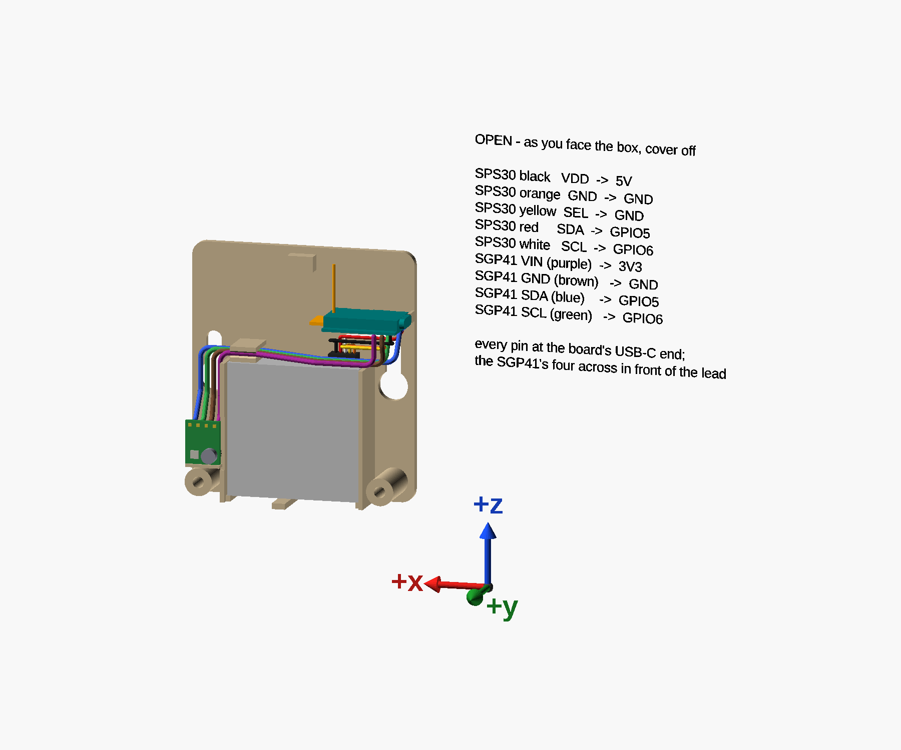
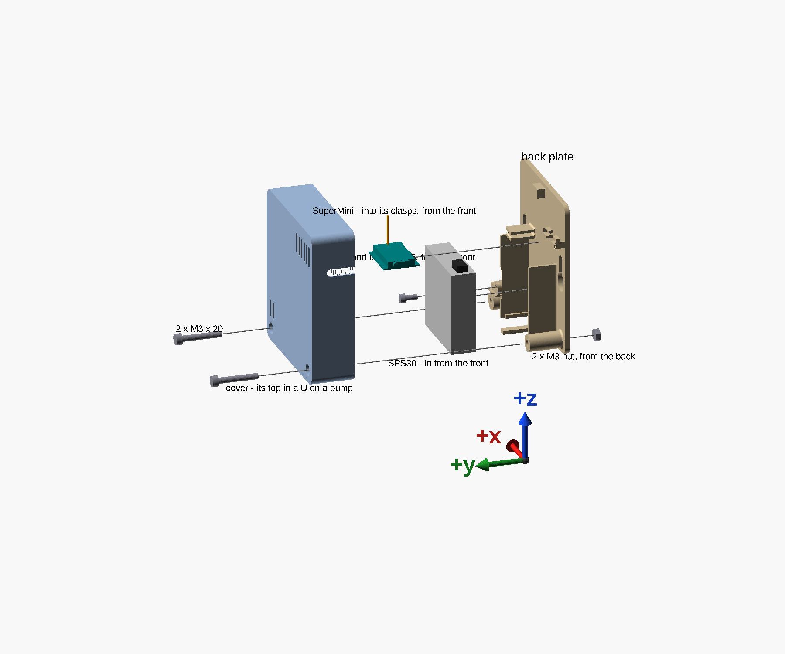

# Air-quality monitor

An ESPHome air-quality monitor — particles with a Sensirion SPS30, VOC and NOx with a GY-SGP41, on an
ESP32-C3 SuperMini — and the printed box it lives in. It watches the air wherever something puts particles
or gases into it: 3D printing, soldering, laser cutting, resin work, sanding, cooking. Its first job is
beside a 3D printer's enclosure, and that is where the design pages measure it, but nothing in the box
assumes a printer.

The box hangs on a wall by two screws, upright, with the SPS30's air face down. Two parts in ASA,
68.7 × 76.4 × 24 mm: a back plate, and a cover whose top locates on a bump in a U and whose bottom corners
are screwed into nuts, the screws' heads flush in its front.

The SuperMini lies level above the SPS30's lead, held by its edges, its antenna's pole standing up; the
SGP41 lies flat in the column beside the SPS30, close behind vents in the cover's front.





Every picture carries the box's own axes as arrows: **x across it, y out from the wall, z up.** Facing the
box, +x points to your left. They are the model's axes, not the printer's: the back plate prints lying on
its back, so on the bed its y is up.

## Status

**The box is modelled, checked, and every fit in it tested** in ASA on the printer; `untested_fits` and
`unmeasured` are both empty, so `scad-check.sh` passes the back plate and the cover.

**Changed since the last printed box** — checked in the model, not printed yet:

- the USB-C slot in the cover's side wall, open to its back edge;
- the divider under the SPS30: a flush wall, placed at the air-face gap measured on the sensor;
- the SGP41 wire channel's lips, now one bead deep;
- the SPS30 standing 2 mm off the plate on three ribs, so air rises behind it and cools it;
- 1 mm fillets at the roots of the thin parts that take a load, and round the SPS30's window.

**The firmware's** configuration is valid and has compiled; it is not flashed yet.

## Building it

1. **Print the two parts** — see *Printing* below.
2. **[Assemble it](docs/assembly.md)**, then **[wire it](docs/wiring.md)**.
3. **Flash the firmware**: copy `firmware/secrets.yaml.example` to `firmware/secrets.yaml`, which is
   gitignored, fill it in, and build [`firmware/print-chamber.yaml`](firmware/print-chamber.yaml) — its
   header says how.

| Part | File | Prints |
|---|---|---|
| Back plate | [`models/air-quality-monitor-back.scad`](models/air-quality-monitor-back.scad) | flat on its back |
| Cover | [`models/air-quality-monitor-cover.scad`](models/air-quality-monitor-cover.scad) | front face down |

**The models need the [`scad-tools`](https://github.com/AlonRR/scad-tools) submodule**, which holds the
shapes they use. Clone with it:

```sh
git clone --recursive https://github.com/AlonRR/air-quality-monitor
```

A ZIP from GitHub comes without it: from the unpacked folder, fetch the version this repository is pinned
to. In PowerShell:

```powershell
$pin = (Invoke-RestMethod https://api.github.com/repos/AlonRR/air-quality-monitor/contents/scad-tools).sha
Invoke-WebRequest "https://github.com/AlonRR/scad-tools/archive/$pin.zip" -OutFile scad-tools.zip
Remove-Item -Recurse -ErrorAction SilentlyContinue scad-tools
Expand-Archive scad-tools.zip . ; Rename-Item "scad-tools-$pin" scad-tools ; Remove-Item scad-tools.zip
```

or in a POSIX shell:

```sh
pin=$(curl -s https://api.github.com/repos/AlonRR/air-quality-monitor/contents/scad-tools | sed -n 's/.*"sha": *"\([0-9a-f]*\)".*/\1/p')
rm -rf scad-tools && mkdir scad-tools && curl -sL "https://github.com/AlonRR/scad-tools/archive/$pin.tar.gz" | tar xz --strip-components=1 -C scad-tools
```

**Hardware:** two M3 × 20 socket head cap screws and two M3 nuts for the cover, one M2.5 × 6 socket head cap
screw for the SGP41, two 4 × 20 chipboard screws and their wall plugs to hang it, and 22 AWG solid hookup
wire for the SGP41. No tape, no glue.

## Printing

Inslogic ASA, with the print profile **"0.2mm QUALITY @MK3 - no skirt, no brim, no crossing perimeter"**.
No skirt, no brim, no draft shield, and no supports: rounded corners keep ASA's corners down, and every
opening is a hole in the first layers or a notch open at an edge.

## How it is designed

| Page | What it covers |
|---|---|
| [Design](docs/design.md) | the rules the SPS30 sets, the layout they produce, and which way is left |
| [What each feature is for](docs/features.md) | both parts, every feature numbered |
| [The USB-C end](docs/usb-c-end.md) | why any cable fits, and what takes a plug's push and pull |
| [The SGP41's mount](docs/sgp41-mount.md) | how the gas sensor sits close to its vents without loading its parts |
| [Parameters](docs/parameters.md) | every measured, sourced and tested value, and where it came from |
| [Checking it](docs/checking.md) | the checks that guard the design, and the controls that prove each can fail |

## What is where

| | |
|---|---|
| [`docs/`](docs/) | the pages above and their pictures |
| [`models/air-quality-monitor.params.scad`](models/air-quality-monitor.params.scad) | every setting, measurement and fit — the one file to edit |
| [`models/air-quality-monitor.layout.scad`](models/air-quality-monitor.layout.scad) | every dimension the settings imply, and the rules (asserts) they must keep — values only, no geometry |
| [`models/air-quality-monitor.scad`](models/air-quality-monitor.scad) | the model: both parts drawn from the layout, and its collision checks |
| `models/air-quality-monitor-back.scad`, `-cover.scad` | one part each; check and slice through these |
| [`models/assembly-views.scad`](models/assembly-views.scad) | the assembly pictures: exploded; open, with every wire's route and the wiring table; the wires at the pins close up; and the wires' collision check |
| [`models/feature-map.scad`](models/feature-map.scad) | the numbered feature pictures |
| [`models/board-measure.scad`](models/board-measure.scad) | the readings taken on the SuperMini and the GY-SGP41 |
| [`firmware/`](firmware/) | the node's ESPHome configuration, with its wiring table, and the secrets template. It is `print-chamber.yaml`, named for its first job: Home Assistant keys the history it records to that name |
| [`scripts/checks.py`](scripts/checks.py) | the collision checks, the positive controls and the pictures, run as [Checking it](docs/checking.md) describes |
| [`scad-project.toml`](scad-project.toml) | what the shared scripts need to know about this repository: its printed parts |
| [`scad-tools/`](https://github.com/AlonRR/scad-tools) | the shared tools, a git submodule: the xyz arrows, shapes and wire routes the models `use`; `scad-check.sh`; `printables.py`, which makes each printed part one `.scad` and its STL for Printables - `uv run scad-tools/scripts/printables.py`, into `printables/` |

## Licence

This is open hardware. **Commercial use is allowed**, but anyone who ships a product made from these designs
must publish their changes under the same licence.

| Licence | Covers |
|---|---|
| [CERN-OHL-S-2.0](LICENSES/CERN-OHL-S-2.0.txt) — CERN Open Hardware Licence v2, Strongly Reciprocal | the design and its documentation: `models/`, `docs/` and this README |
| [MPL-2.0](LICENSES/MPL-2.0.txt) — Mozilla Public License 2.0 | the code: `firmware/` and `scripts/` |

Every file says which licence applies to it. The `.scad` files, the script and the firmware carry an SPDX
header; `REUSE.toml` covers the rest, and the repository passes `reuse lint`. `LICENSE` at the root is
the CERN-OHL-S text again, for tools that look only there.

## Related

This repository was split out of the [3D-printing toolkit](https://github.com/AlonRR/3d-printing-toolkit),
with its history. The toolkit holds the FDM design rules and the slicer profiles the box is printed with;
the chamber-sensor notes the firmware follows, and the `.yaml` files its comments name, are in
[**printer-enclosure**](https://github.com/AlonRR/printer-enclosure), the enclosure this monitor hangs
beside. A `docs/…` page named in a comment, and not found here, is in one of the two.

_Parts of this repository were drafted with the help of an LLM agent; reviewed and verified locally._
