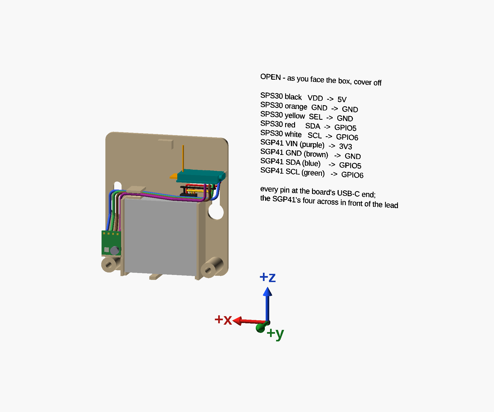

# Air-quality monitor

An ESPHome node that measures the air around a 3D printer — particles with a Sensirion SPS30, VOC and NOx
with a GY-SGP41, on an ESP32-C3 SuperMini — and the printed box it lives in. The box hangs on a wall by
two screws, outside the printer's enclosure, with the SPS30's air face down.

**Status:** the box is modelled and checked, and every fit in it has been tried in ASA on the printer. The
USB-C slot in the cover and the flush divider under the SPS30 changed after the last printed box, and are
not printed yet. The firmware's configuration is valid and has compiled; it is not flashed yet.

## What is here

| | |
|---|---|
| [`models/air-quality-monitor/`](models/air-quality-monitor/) | the box — **start at its README**: printing, assembly, wiring, and how it is designed |
| [`firmware/print-chamber.yaml`](firmware/print-chamber.yaml) | the node's ESPHome configuration, with its wiring table |
| [`firmware/secrets.yaml.example`](firmware/secrets.yaml.example) | copy it to `firmware/secrets.yaml`, which is gitignored, and fill it in |
| [`scripts/scad-check.sh`](scripts/scad-check.sh) | renders a part, checks the mesh, slices it, and cross-checks the model against the profile |
| [`models/lib/axes.scad`](models/lib/axes.scad) | the x, y and z arrows every figure carries |

How to check a change to the box: [Checking it](models/air-quality-monitor/docs/checking.md).

## Licence

| Licence | Covers |
|---|---|
| [CC-BY-4.0](LICENSES/CC-BY-4.0.txt) — Creative Commons Attribution 4.0 | the box: `models/`, its pages and figures, and the READMEs |
| [MPL-2.0](LICENSES/MPL-2.0.txt) — Mozilla Public License 2.0 | the code: `firmware/` and `scripts/` |

Every file says which licence applies to it. The `.scad` files, the script and the firmware carry an SPDX
header; `REUSE.toml` covers the rest.

## Related

This repository was split out of the [3D-printing toolkit](https://github.com/AlonRR/3d-printing-toolkit),
with its history. The toolkit holds the material these files refer to: the FDM design rules, the OpenSCAD
lessons, the chamber-sensor notes the firmware follows, and the slicer profiles the box is printed with —
Inslogic ASA, and the print profile "0.2mm QUALITY @MK3 - no skirt, no brim, no crossing perimeter". A
`docs/…` path or a `.yaml` named in a comment, and not found here, is in the toolkit.

_Parts of this repository were drafted with the help of an LLM agent; reviewed and verified locally._
