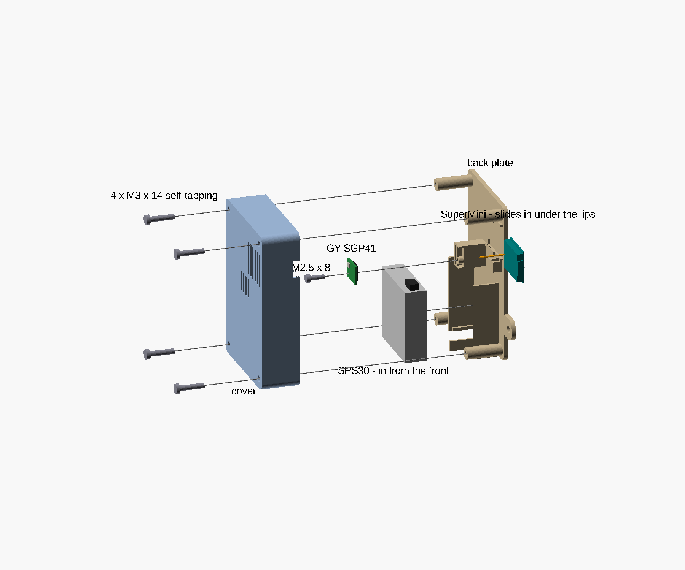
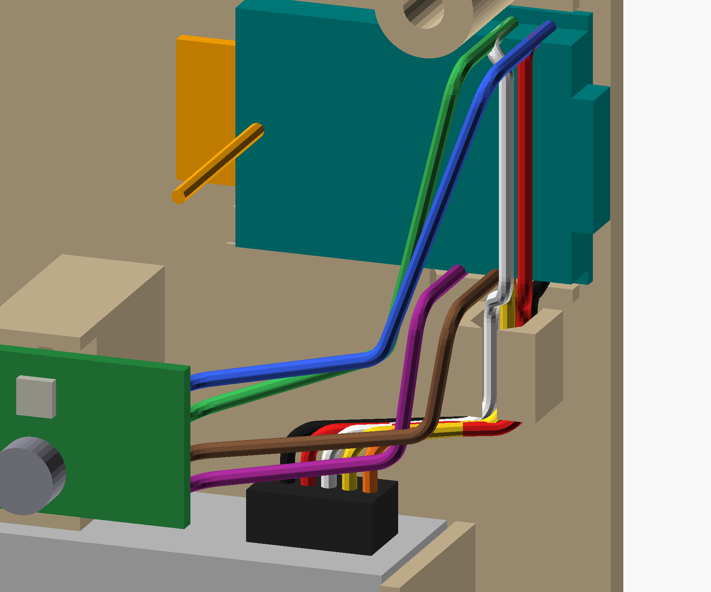
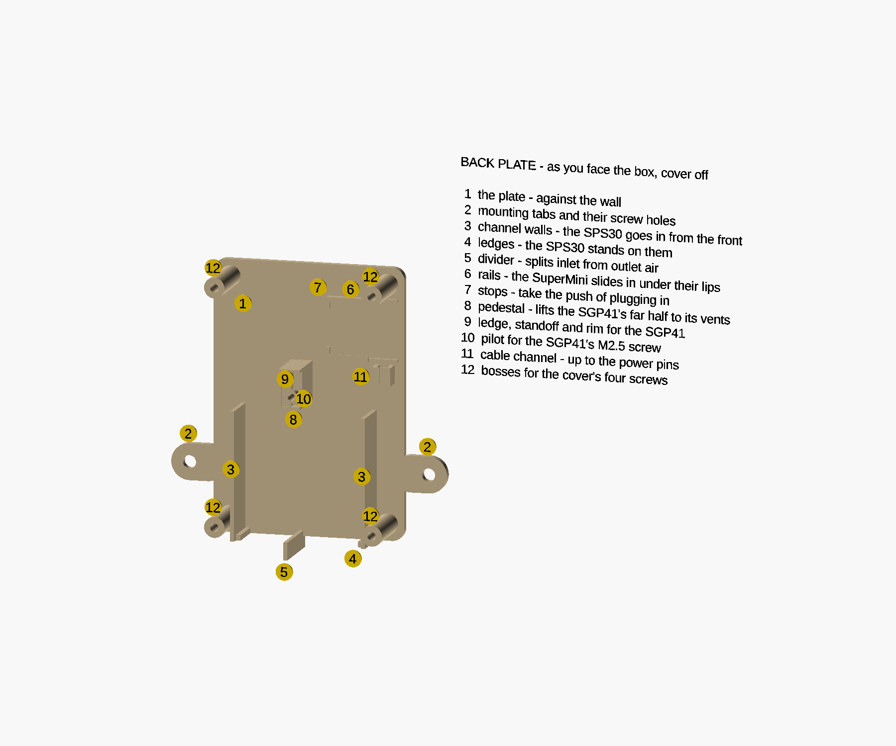
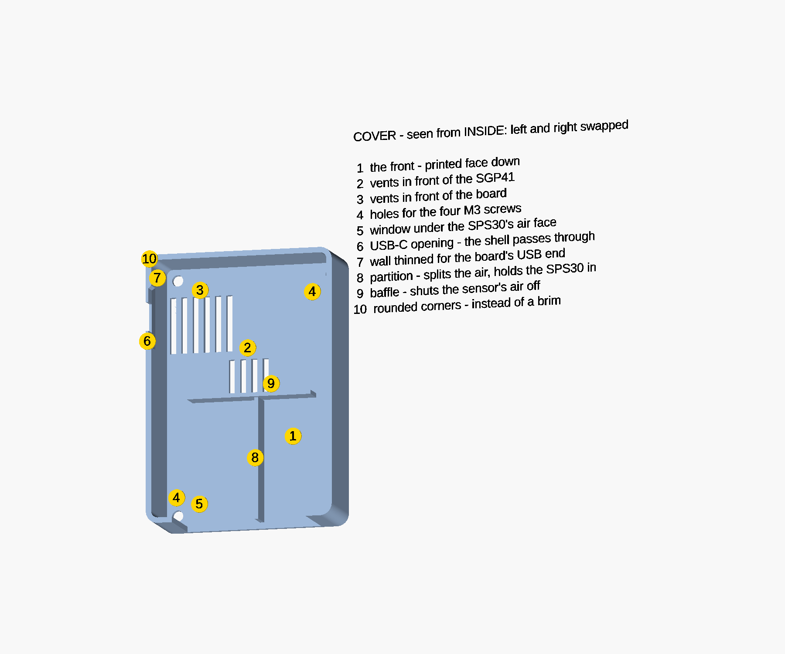

# print-chamber box — enclosure for the printer chamber node

**Status: MODELLED, NOT YET PRINTABLE AS-IS.** The model is complete and passes every check, and every
dimension is measured or sourced, but seven fits are untested in ASA. It says so itself: `scad-check.sh`
**exits 2 on purpose** until the `untested_fits` list is empty. Every dimension has a name, so values go
in against names rather than descriptions.

Decided 1 Oct 2026: upright with the air face down, two screw tabs, a cover held by four screws, ASA.
Settled from photos, 2 Oct 2026: the SPS30's outlet is on your RIGHT as you face the box, and the
antenna wire stands out of the board's component side. Measured the same day: the SuperMini and the
GY-SGP41. Also 2 Oct: the USB-C socket's mouth reaches the outside face, so **no cable needs measuring**
(see [The USB-C end](#the-usb-c-end)); and the wiring round — the SGP41 raised to its vents beside the
SPS30's lead, a channel for the wires, and where every wire goes (see [Wiring](#wiring)). Changed the
same day after Alon's review: **the SPS30 goes in from the front** — the lips that held it made that
impossible, and from above the board's rims and the pedestal were in the way — and the SGP41 rests on a
ledge and a standoff clear of the parts on its underside.

It houses the node in [`firmware/print-chamber.yaml`](../../firmware/print-chamber.yaml): an ESP32-C3
SuperMini, a Sensirion SPS30 particle sensor and a GY-SGP41 VOC/NOx module.

## The rules that shape it — and where each comes from

Most of the layout is decided by the SPS30, and Sensirion publishes the rules.

| Rule | Source |
|---|---|
| **Two inlets and one outlet, all on one 40.6 × 12.2 mm face.** The large slotted grille is the **outlet**; the two inlets sit at the other end, one of them wrapping round the edge | *Mechanical Design and Assembly Guidelines for SPS30*, §1 figure |
| **Couple that face to the room through a large opening, with minimal depth in front of it.** A constricted volume in front makes outlet air flow back into the inlets | guidelines §2.1 |
| **A tight seal between the inlet side and the outlet side** gives the best performance | guidelines §2.1 |
| **Openings facing down** is the best orientation — it avoids dust settling in the sensor | guidelines §2.2 |
| **Keep it away from heat sources such as microcontrollers, and below them** — convection from a warm board heats the sensor | guidelines §2.4 |
| **Do not cover the entire sensor surface** in an all-round casing, or it overheats | guidelines §3 |
| **Isolate it from airflow faster than 1 m/s** — so not in the fume fan's stream | guidelines §2.3 |
| **The metal housing is tied to GND and must stay electrically floating**; current through that link *"may damage the product and poses a safety risk through overheating"* | datasheet v2.0 §3 |
| **Connector on the face opposite the openings** | datasheet v2.0 §3 |
| **I2C lead under 20 cm** | datasheet v2.0 §3 |

And two from this repository:

- **The SGP41 is rated -10 to +50 °C** and the SPS30 to +60 °C, against a chamber wanted at 40–60 °C.
  So the box sits **outside** the enclosure ([chamber-sensor §3](../../docs/chamber-sensor.md)).
- **The SuperMini carries the 31 mm antenna-wire mod**, whose last **15 mm stand straight up** from the
  board ([chamber-sensor §3x](../../docs/chamber-sensor.md)). It needs free space in plastic, and should
  not run alongside the SPS30's grounded metal case.

## The layout those rules produce

Every rule above points the same way. Stand the SPS30 on edge with its air face **down**; that puts its
connector **up**, facing the board; the board goes **above** the sensor, so its heat rises away; and the
board's antenna end sits in the top compartment, as far from the sensor's metal case as the box allows.

Drawn from the model, as you face the box, for the sensor in hand (`outlet_at_left = false`):

```
                  FRONT, as you face it                                 SIDE SECTION, through the SGP41
          |<------------------------ W ------------------------->|     back            front
          +------------------------------------------------------+     +--+----------+--+    ^
          | o                                                  o |     |  |          |  |    |
          |                            +---------------------+   |     |  |board     |  |    |
          | antenna end - its wire    o|  C3 SuperMini       |====     |  |  + wire  |  |    |
          | stands out towards you     |  pins at this end ->|   |     |  |          |  |    |
          |                            +---------------------+   |     |  |          |  |    |
          |             +---------------+  : lead :   (post)     |     |  +--------+]|  |    |  H
          |      vents  |   GY-SGP41    |  :      :              |     |  |pedestal|]|  |    |
          |             +--- raised ----+  :      :              |     |  +--------+]|  |    |
          |   +--------------------------------------------+     |     |  +------+   |  |    |
          |   |  SPS30 on edge, label facing you,          |     |     |  |      |   |  |    |
          |   |  connector UP at the outlet end            |     |     |  |SPS30 | gap  |    |
          |   |  air face DOWN                             |     |     |  |      |   |  |    |
          |   +--------------------------------------------+     |     |  +------+   |  |    |
          | o --[  inlet window  ]#[     outlet window     ]-- o |     +--[  window   ]--+    v
          +------------------------------------------------------+
                                   #  the divider: carries the sensor, separates the two
                                      ends, and stands divider_proud below the box
          "=" on the right wall: where the USB-C cable leaves, beside the board
          ":" the column the SPS30's lead rises through; "(post)" the cable channel the wires lie in
          "]" the SGP41 on its pedestal, a few mm behind its vents in the cover's front
```

The window is one large opening over the whole air face, split by a single divider. That way the box
does not have to hit each grille exactly — it only has to put the divider in the gap between the two
ends, which is one number to measure.

## Parameters

**Sourced** — from the SPS30 datasheet v2.0, Figure 7:

| Name | Value | Note |
|---|---|---|
| `sps_w`, `sps_h` | **40.6 ± 0.3** | without the shipping foil, which can stay on |
| `sps_w_nubs` | **41.2** | including the small plastic nubs on the sides |
| `sps_t` | **12.2 ± 0.3** | |
| `sps_mass` | **26.3 g** | |

**Measured** — 2 Oct 2026, with calipers on the parts in hand, and one value from a photo:

| Name | Value | What |
|---|---|---|
| `divider_from_inlet_end` | **17.7** | from the inlet end to the middle of the blank gap before the outlet grille. Scaled off a straight-on photo against the sensor's 40.6 mm width; three features land within 0.4 mm of the datasheet, so the scale holds. The gap runs from `sps_inlet_end` 15.2 to `sps_outlet_from` 20.2, and an assert keeps the divider inside it |
| `sm_l`, `sm_w` | **22.8 × 18.03** | the SuperMini's PCB, not counting the USB-C shell |
| `sm_pcb_t`, `sm_t` | **0.85**, **4.05** | the bare PCB; the PCB with its tallest part, the USB-C shell, without the antenna |
| `usb_shell_h`, `usb_overhang` | **3.16**, **1.5** | the USB-C shell's height, and how far it overhangs the PCB's edge |
| `ant_h`, `ant_over` | **18.8**, **4.81** | the antenna wire's tip above the PCB's underside; how far its loop reaches past the PCB's antenna end, in the board's plane |
| `ant_loop_free` | **4.3** | how much of the antenna end the loop leaves free beside it — 4.3 mm one side, 5.45 the other; the smaller is used both sides |
| `gy_l`, `gy_w`, `gy_t` | **13.14 × 10.60 × 3.24** | the GY-SGP41 with its parts. The sensor is on one face and the rest of its electronics on the other |
| `gy_back` | **2.53** | the GY-SGP41 through its PCB and electronics, clamped beside the sensor: its height lying sensor-up |
| `cable_zone_h` | **10** | above the SPS30's connector face, with the lead plugged in and bent over as tightly as it comfortably goes |
| `conn_from`, `conn_to` | **2.0**, **10.5** | where the SPS30's plug and lead sit along its top face, from the outlet end. From photo 1, scaled against the sensor: the wires leave 3.0–8.6 mm from that end, and the housing reaches about 1 mm past each |
| `sm_edge` | **1.0** (photo) | the strip along each long edge of the SuperMini's component side that carries only its castellated pads. The rails' lips reach 0.6 mm over it, no further |
| `pin_mid` | **5.1** (photo) | the middle of the SuperMini's three power pins from its USB-C end; photo 1 reads 2.6, 5.1 and 7.7. The cable channel stands under it |
| `gy_bare` | **3.31** | from the GY-SGP41's far end (opposite its pins) to the nearest part on its underside. The ledge stops 0.5 mm short of it. An earlier photo reading of about 4.5 put the ledge under the parts |
| `gy_hole_bare_d` | **5.2** (photo) | the bare patch round the mounting hole on the underside: photo 2 puts the nearest parts beside and above the hole about 2.6 mm from its centre. The 4 mm standoff (`gy_standoff_d`) sits inside it |
| `gy_hole_d` | **3.13** | the GY-SGP41's mounting hole, across |
| `gy_hole_far`, `gy_hole_side` | **1.32**, **1.25** + half the hole | from the hole's edge to the module's far end (the short edge opposite its pins), and to the nearer long edge (the one away from the sensor). The file adds half the diameter to put the centre at 2.885 and 2.815 |

**Bounds, not measurements** — the design works anywhere inside them, so none needs measuring:

| Name | Value | Why |
|---|---|---|
| `gy_pcb_min`, `gy_pcb_max` | **0.8**, **1.6** | the GY-SGP41's bare board thickness. GY modules are usually 1.0–1.6 mm |

**Sourced** — the SGP41's screw, an M2.5 × 8 socket head cap screw to ISO 4762: `gy_head_d` **4.5**,
`gy_head_h` **2.5**.

**Sourced** — from the USB Type-C compliance document, rev 1.2, so that no cable needs measuring:

| Name | Value | Note |
|---|---|---|
| `usb_shell_w` | **8.94** | the receptacle's inside opening is 8.34 × 2.56; the measured 3.16 height against 2.56 gives a 0.30 mm shell wall, so 8.34 + 2 × 0.30 |
| `usb_plug_w`, `usb_plug_h` | **12.35 × 6.5** | the largest a compliant plug's body may be (Figure B-1, dimensions 1 and 14). The body stays outside the box, so these only check that it clears the tabs and the mounting surface |

**Nothing is left to measure.** If a part changes, set the new value in
[`print-chamber-box.params.scad`](print-chamber-box.params.scad); a placeholder goes in the `unmeasured`
list there, which makes the model warn until it is measured.

## The two parts

| Part | Prints | What it carries |
|---|---|---|
| **Back plate** — [`print-chamber-box-back.scad`](print-chamber-box-back.scad) | flat | two mounting tabs; a channel the SPS30 is set into from the front; a ledge under each end of its air face; the divider; the board's pocket, with two stops that take the push of plugging in; a pedestal that raises the SGP41 to its vents, with a ledge and a standoff for it; a cable channel for the wires; four bosses for the cover screws |
| **Cover** — [`print-chamber-box-cover.scad`](print-chamber-box-cover.scad) | front face down | the window under the SPS30; the USB-C opening, in a stretch of wall thinned from inside with a chamfered step; vents in front of the SGP41 and the board; a partition that continues the divider up the air gap in front of the sensor, and keeps the SPS30 from tipping forward; a baffle that closes that gap off from the warm compartment above |

Hardware: four **M3 × 14 self-tapping** screws close it, and two wood screws up to 3.5 mm hang it. **One
M2.5 × 8 socket head cap screw** holds the SGP41 down through its mounting hole. Double-sided tape
is not needed anywhere: the SuperMini is held by the rails and the cover — see below.

**The SuperMini slides in from its USB-C side**, before the cover: antenna end first, under the rails'
lips, until it meets the stops. The cover's thinned wall then closes behind it. `check_slide` proves its
way in is clear.

**The SPS30 goes in from the front**, before the cover: set it between the channel walls and onto its
ledges. Nothing on the plate overhangs it — `check_insert` proves its path in is clear — and once the
cover is on, its partition rib stands 0.3 mm off the sensor's face and keeps it from tipping forward.

**No bridge over air in either part.** Every opening in the cover is a hole in its first layers or a
notch open at its back edge. The slicer does report seven *bridge infill* regions in the back plate, and
each was traced: all are internal, the first solid layer over the part's own sparse infill — PrusaSlicer
uses the same label for both. Five are in the plate and the bosses; the other two (2 Oct 2026) are the
top of the SGP41's pedestal and the floor under its screw's blind pilot, each inside the pedestal. The
cable channel's 45° lips print with no overhang perimeters at all. The cover reports none.

**"Left" and "right" mean as you face the box.** The model's frame is right-handed with Y out of the wall,
so +X points to your left. The board's USB-C end faces the SPS30's connector, so with this sensor the
cable leaves on your right. Every pin the node uses (5V, GND, 3V3, GPIO5, GPIO6) is at that end of the
board, which leaves the antenna end with no wire near it.

## Assembly

Drawn by [`assembly-views.scad`](assembly-views.scad), which includes the model.



In this order, all before the cover:

1. **Slide the SuperMini in** from its USB-C side, antenna end first, under the rails' lips until it meets
   the stops.
2. **Set the SPS30 in from the front**, between its channel walls and onto its ledges.
3. **Solder the SGP41's four wires first, then screw it down** with the M2.5 × 8, through its mounting
   hole into the standoff. Its wires come out of its back, which cannot be reached once it is down.
4. **Wire it** — next picture. The SPS30's five wires press into the cable channel; the SGP41's four run
   from behind it across to the board.
5. **Put the cover on** with the four M3 × 14 self-tapping screws. Its partition rib holds the SPS30, its
   thinned wall closes behind the SuperMini.




The routes are illustrative — a wire bends where it likes — but each ends on the pin the wiring table
gives it. The SPS30's five run up the cable channel. The SGP41's four come out of its back and run across
to the board, with no bend tighter than 2 mm; GPIO5 and GPIO6 then cross the front of the board's USB-C
end to its upper edge. The SPS30's colours are the meter-checked ones; the SGP41's are stand-ins for
whatever hookup wire is used.

## What each feature is for

Drawn by [`feature-map.scad`](feature-map.scad), which includes the model, so the numbers move with it.



**The back plate**, as you face the box with the cover off:

1. **The plate** — the back of the box, flat against the wall. Everything else stands on it, and it
   prints flat on the bed.
2. **Mounting tabs** — one each side, with a hole for a wood screw up to 3.5 mm. 14 mm long, so the
   screwdriver's shaft clears the box's side.
3. **Channel walls** — the SPS30 is set between them from the front, and they hold it sideways. No lips:
   anything overhanging its face would have to be slid past, and from above the way is blocked.
4. **Ledges** — the sensor stands on these, one under each end of its air face, clear of the openings.
5. **Divider** — carries the middle of the sensor and splits its inlet side from its outlet side. It
   stands 4 mm proud below the box, so the outlet's air cannot loop straight back into the inlets.
6. **Rails** — the SuperMini slides in under their 45° lips from its USB-C side, antenna end first,
   before the cover goes on, until it meets the stops (7). The lips run from its 4th pin to its antenna
   end, clear of the pins its wires are soldered to, and keep it down on the plate; once the cover is on,
   the socket in its snug opening holds the other end. No tape.
7. **Stops** — over the two corners of the board's antenna end. They take the push of plugging the USB-C
   cable in; the middle stays open for the antenna loop.
8. **Pedestal** — lifts the SGP41 forward, so its sensor sits 2–3 mm behind its vents instead of 16 mm.
   It stands under the module's far half only: behind the pin half there is nothing down to the plate,
   because the wires come out of the module's back there.
9. **Ledge, standoff and rim** — the SGP41 rests on a strip along its far end, kept 0.5 mm short of the
   parts on its underside, and on a round standoff under its mounting hole. The rim locates it on three
   sides along the pedestal, and is open towards the pins.
10. **Pilot** — for the M2.5 × 8 screw through the module's mounting hole into the standoff.
11. **Cable channel** — 6 mm long (`wire_ch_l`), upright directly under the board's three power pins. The wires from both
    sensors press in from the front past a 45-degree lip on each wall, run up it, and leave its top end
    straight into the 5V, GND and 3V3 pads; no tie needed.
12. **Bosses** — the cover's four M3 × 14 self-tapping screws bite into these. Their pilots are blind, so
    the back of the plate stays whole.



**The cover**, seen from inside — from the wall — so its left and right are swapped against the box as
you face it:

1. **The front** — printed face down, so it comes out flat.
2. **Vents in front of the SGP41** — room air reaches the gas sensor.
3. **Vents in front of the board** — the board's warmth leaves here. With the lower vents they should
   act as a small chimney, drawing fresh air in past the SGP41 (reasoned, not measured).
4. **Screw holes** — clearance for the four M3 screws into the bosses.
5. **Window** — most of the bottom wall is open under the SPS30's air face, so its inlets and outlet
   breathe the room directly. Open at the back edge, so it prints without a bridge.
6. **USB-C opening** — the size of the socket's metal shell. The socket's mouth reaches the outside face,
   so any cable seats fully.
7. **Thinned wall** — 0.9 mm over the board's USB-C end, so the board reaches into it and the socket
   reaches the outside. The board's corners bear on it when a plug is pulled; the 45° step keeps a crack
   from starting.
8. **Partition** — continues the divider up the air gap in front of the sensor, so the inlet air and the
   outlet air stay apart. It stands 0.3 mm off the sensor's face, so it also keeps the SPS30 from tipping
   forward now that the plate has no lips.
9. **Baffle** — closes that air gap off from the compartment above, so the board's warmth does not drift
   down into the sensor's air.
10. **Rounded corners** — ASA lifts at sharp corners; the radius is what lets both parts print without a
    brim.

## The USB-C end

**The socket's mouth reaches the box's outside face, so a plug's body never enters the box** — any
cable fits, and none needs measuring. A 1.8 mm wall would leave the mouth 0.6 mm inside it, because the
shell overhangs the PCB by only 1.5 mm. So over the board's end the wall is thinned from inside to
`port_wall` (0.9 mm, two beads), and the PCB's end reaches into that recess. The opening through what is
left is the size of the shell, not of a plug.

The board can move `part_fit` either way along its length, and both ends of that travel are stops:

- **Pulling a plug out** draws the board outwards until the PCB's corners, either side of the shell, bear
  on the thinned wall.
- **Pushing a plug in** drives the board inwards, against **two stops over the corners of its antenna
  end**. Without them it would slide away from the plug, and the mouth would retreat into the wall at
  exactly the moment it must not. Each stop reaches `stop_reach` (3 mm) in from its rim, 2.7 mm over the
  PCB. The antenna loop lies in the board's plane past that end and leaves 4.3 mm and 5.45 mm of it free
  (measured 2 Oct 2026), so the stops clear it by at least 1.6 mm; an assert keeps it that way.

The recess is as tall as the board's tallest part, not just as thick as the PCB, because something besides
the socket sits 0.69 mm from the board's USB end on the component side (measured 2 Oct 2026). That
makes the thinned wall the one stretch a plug's pull-out force bears on across the layer lines, so its
step back to the full wall is a 45-degree chamfer rather than a square inside corner, where a crack would
start.

Pushed in, the mouth is flush with the outside face; pulled out, it stands 0.6 mm proud. An assert
blocks any setting that would leave it inside the wall. The plug's body then sits beside the box, 4.83 mm
from the mounting surface at its centre, so **any body up to 9.66 mm thick clears the wall the box is
screwed to**. A compliant one is at most 6.5 mm. The model echoes both figures.

**Why it was changed** (2 Oct 2026): the first version left the mouth 0.6 mm inside the wall and sized
the opening for a measured plug. Even with the right number, the back plate's edge, which the cover's
opening does not reach, would have stopped a compliant 6.5 mm plug body 0.6 mm short of seating. That was
a 6.1 mm³ overlap, found by drawing that plug into the earlier version.

## The SGP41's mount

**Its sensor faces the vents, and a pedestal brings it within 2.1–2.9 mm of them** — measured to the
sensor's face, which stands 0.71 mm proud of its board. Lying on the plate it
would sit 16 mm behind its vents and measure the box's own air, warmed by the board, more than the room's.
It stands just left of the SPS30's lead, in the zone between the sensor and the board, with its pins
towards the board's pin end, so its four wires head straight there.

**It rests on two bare patches of its underside, so its parts never bear load.** One is the strip along
its far end: the nearest part is 3.31 mm in (`gy_bare`, measured), and the ledge stops 0.5 mm short of it.
The other is round the mounting hole, where a 4 mm standoff carries it. Its pin half overhangs, with
nothing behind it down to the plate: the pedestal stops a rim's width past the standoff. The ledge is tall enough that the parts on the thinnest plausible board clear the floor
by `gap` (1 mm): the floor prints as a solid skin over infill and can come out a few tenths uneven.
Because the board touches nothing but the ledge and a rim on three sides, its thickness does not matter:
anywhere from `gy_pcb_min` to `gy_pcb_max`, the rim catches its edge and the room in front is kept. The
rim is open towards the pins.

**An M2.5 × 8 screw holds it down, through its mounting hole into a blind 7.6 mm pilot in the standoff.**
The hole is by the long edge away from the sensor, and the screw clamps only the bare patch round it. That
patch's size is a photo reading (`gy_hole_bare_d`), and the collision check treats its edge as where the
parts begin.
Its 4.5 mm head clears the sensor: checked with the screw in the hole, 2 Oct 2026. The hole is 3.13 mm,
so the M2.5 screw passes it with room to spare, and the rim, not the screw, locates the module. Which edge
of the pocket the hole sits by comes from photo 1, so the pilot is only as right as that reading; seat the
module in the printed pocket and look before driving the screw. The screw cuts its own thread in the pilot
(`gy_pilot_d`, an untested fit). An M2 screw is not the fallback for a smaller hole: its pilot would be
under the 2 mm minimum. The room in front of the board is the screw's head, 2.5 mm tall, plus
`part_fit` to the cover.

**Its wires come out of its back.** Each is soldered so it leaves its pad from the back of the board,
straight for 1 mm, then bends over on 2 mm; where two cross, one lies behind the other — 4.6 mm in all.
`wire_room`, 5 mm, is the room kept behind the pin half for that, and the collision check holds the
pedestal out of it. The wires came out of the front until 2 Oct 2026, first with 2.5 mm to bend in —
room for a bend, but not a gentle one — and then with 5 mm, which pushed the sensor to 4.3–5.1 mm behind
its vents. Out of the back they cost the sensor nothing: it is 2.1–2.9 mm behind them again.

The pedestal clears the cover's baffle over the sensor; the box grew 0.95 mm taller for that, to 88.9 mm.
It also stands under the board's antenna end, 6.5 mm below the loop. That was the one place it fits
between the lead and the loop, and it keeps the SGP41's wires on the far side of the antenna; an assert
keeps it at least `gap` below the loop, and the model echoes the distance.

## Wiring

**Solder at the board, from its component side, with no headers.** Pin headers and Dupont housings stand
about 22 mm off the board, and there is not that much room in front of it. The sensors keep their own
connectors, or in the SGP41's case its own pins, so either can be swapped without unsoldering the
SuperMini.

| Wire | From | To the SuperMini | Its edge, as installed |
|---|---|---|---|
| SPS30 black | pin 1, VDD | **5V** | lower edge, 1st from the USB-C end |
| SPS30 orange | pin 5, GND | **GND** | lower edge, 2nd |
| SPS30 yellow | pin 4, SEL | **GND** | lower edge, 2nd |
| SGP41 GND | GND | **GND** | lower edge, 2nd |
| SGP41 VIN | VIN | **3V3** — never 5V | lower edge, 3rd |
| SPS30 red | pin 2, SDA | **GPIO5** | upper edge, 1st |
| SGP41 SDA | SDA | **GPIO5** | upper edge, 1st |
| SPS30 white | pin 3, SCL | **GPIO6** | upper edge, 2nd |
| SGP41 SCL | SCL | **GPIO6** | upper edge, 2nd |

The colours are this lead's, found with a meter on 1 Oct 2026 —
[`firmware/print-chamber.yaml`](../../firmware/print-chamber.yaml) says how, and why colours are not to be
trusted on another lead. Three wires share the GND pad: twist the SPS30's orange and yellow together first.
Why the SGP41's VIN must be 3V3 is in the same file.

**The routes:**

- **The SPS30's lead** rises from its plug at the outlet end and bends over towards the right wall. Its
  column is kept clear: the SGP41's pedestal stands to its left, and the cable channel to its right.
  **Shorten the lead** so it reaches the board with about a centimetre to spare, rather than coiling it:
  the SPS30 has a fan, and a slack lead buzzes.
- **In the cable channel**, upright under the board's power pins, press the SPS30's five wires in from
  the front past its lips. It holds them in place; nothing pulls on them inside a closed box, so it does
  not need to grip.
- **From the channel to the pins:** 5V, GND and 3V3 are on the board's lower edge, right above it.
  GPIO5 and GPIO6 are on its upper edge, so their wires cross the board's front **over its USB-C end**,
  about 8 mm out. GPIO6's pad is straight above GND's, so its wire rises half a pin aside, between the
  5V and GND pads: GND's own pad stays open to the SGP41's wire, which comes in from the front.
- **The SGP41's four wires do not use the channel.** Solder them so they come out of the module's back,
  before it is screwed down. They leave straight towards the plate, bend over at least 1 mm from the
  board, and run across to the SuperMini about 13–15 mm out from the plate: in front of the SPS30's lead,
  along under the board until they are past its middle, then up to their pins and straight into them.
  The module's pins run SDA, SCL, GND, VIN down its edge, the reverse of the board's order, so two pairs
  cross; one wire lies behind the other there. Cut each to length at its pad.
- **Over the SPS30's lead,** the SGP41's wires pass through the column kept for that lead — kept clear
  of printed parts, not of wires. In the drawing they pass 5 mm in front of the lead's own wires, and the
  wiring view checks that no two wires come within a wire's width of each other.
- **Never:** across the board's antenna half, in front of the antenna wire, or anywhere in the window or
  the air gap in front of the SPS30.

**The USB-C cable has no clamp on the box — a change from the plan.** A plug's body typically runs 2–3 cm
out from the wall, and the cable only starts beyond that; the nearest part of the box, the tab, ends
14 mm out and 40 mm lower. Nothing on the box could hold the cable without forcing it into a loop. The
socket is protected anyway: the shell-sized opening takes side loads into the wall, and the thinned wall
takes a pull. **Clip the cable to the wall 3–5 cm from the plug** with a stick-on cable clip.

## The clearance test

**Print [`print-chamber-box-fits.scad`](print-chamber-box-fits.scad) before the box**, in the same ASA
with the same profile: one part, about 1 h 45 min and 15 g. It tries every setting in `untested_fits` three
ways, and every size comes from the box's own settings, so it tests exactly what the box will print.
Each try carries dots: **1 = a step tighter, 2 = as set, 3 = a step looser**.

| Setting | Pieces | Try | Pick |
|---|---|---|---|
| `sps_fit` (0.2 / 0.3 / 0.4) | three open frames | slide the SPS30 through each | the tightest it slides through without forcing |
| `pocket_fit` (0.2 / 0.3 / 0.4) | three SuperMini trays, three GY-SGP41 trays | drop each board in | the tightest that each board drops into and lies flat in, without pressing |
| `pilot_d` (2.3 / 2.5 / 2.7) | the three tall bosses | drive an M3 × 14 self-tapping screw fully in, then back out | the one that bites firmly without splitting the boss or taking real force |
| `gy_pilot_d` (2.0 / 2.1 / 2.2) | the three short bosses | the same with an M2.5 × 8 cap screw | as above |
| `screw_d` (3.2 / 3.4 / 3.6) | the bar, upper row, left to right | an M3 screw | the smallest it passes through freely |
| `tab_hole_d` (3.8 / 4.0 / 4.2) | the bar, lower row, left to right | the wood screws that will hang the box | the smallest they pass through freely |
| `part_fit` (0.3) | the peg, and the socket beside it | calipers: the peg's width and the socket's | the socket is drawn 0.6 mm wider. If (socket − peg) / 2 comes out under 0.15 mm, the box's parts will bind — raise `part_fit` by the shortfall |

Then set each value in the params file and delete its name from `untested_fits`. If even the tighter
try is loose, or the looser one still binds, the ladder was in the wrong place: say so, and it moves.

## Checking it

```sh
scripts/scad-check.sh models/print-chamber-box/print-chamber-box-back.scad \
    "0.2mm QUALITY @MK3 - no skirt, no brim, no crossing perimeter" "Inslogic ASA"
scripts/scad-check.sh models/print-chamber-box/print-chamber-box-cover.scad \
    "0.2mm QUALITY @MK3 - no skirt, no brim, no crossing perimeter" "Inslogic ASA"
scripts/scad-check.sh models/print-chamber-box/print-chamber-box-fits.scad \
    "0.2mm QUALITY @MK3 - no skirt, no brim, no crossing perimeter" "Inslogic ASA"
```

The clearance test has no warnings of its own, so it exits 0.

**No skirt, no brim, no draft shield** — the house rule since 2 Oct 2026, and `scad-check.sh` fails a
G-code with either. The plain profile above has neither, and uses cubic infill; ASA's lifting corners
are answered by `corner_r` in plan view instead.

Check through these two wrappers, never through `print-chamber-box.scad` itself. `part` in the params
file is also the line you change to view a part, and `scad-check.sh` takes no `-D` - so checked through
the model, the "back plate" check silently checks whatever part is on screen. That happened on
2 Oct 2026: it reported a part 62.8 mm wide, which is the cover.

Both should report one manifold part and `fdm_*` matching the profile - the back plate 90.8 mm wide
with its tabs, the cover 62.8 mm. **Exit 2 is expected** while the
`unmeasured` and `untested_fits` lists are not empty; exit 0 means both are clear.

Four more checks, which `scad-check.sh` does not run:

- `-D 'part="check_parts"'` intersects the two parts. The result must have **zero volume** — they meet at
  the plate's face and the boss tops, and nowhere else. Positive controls: `part_fit = -0.6`, with the
  cable channel's walls held where they are (`wch_x0 = 3.2`, `wch_x1 = 9.4` — otherwise the negative fit
  trips the channel's assert first), measured 359.8 mm³, and `gz0 = 44.5` (the SGP41's pedestal lowered
  into the cover's baffle) 10.4 mm³, so the check does see a real overlap.
- `-D 'part="check_components"'` intersects both parts with the sensor, the boards, the antenna wire
  and loop, the USB-C shell, the body of the largest compliant plug — seated with the board pushed
  against its stops — the column the SPS30's lead rises through, the SGP41 at every board thickness
  within the bounds, the room behind its pin half where its wires leave (`wire_room` deep), and its
  screw's head. It must be **empty**. Positive controls: `sm_pocket_h = 17` (a pocket narrower than the
  board) measured 23.5 mm³, `gx0 = 12` (the pedestal moved into the lead's column) 187.1 mm³,
  `gy_ped_x0 = 22.6` (the pedestal as long as the module again, under its pins) 171.5 mm³, `gy_strip = 4` (the ledge reaching under the SGP41's parts) 6.5 mm³,
  `gy_standoff_d = 5.6` (the standoff wider than the bare patch) 2.8 mm³, `wch_cx = 17` with the walls'
  extent left as set (the cable channel moved into the lead's column, past its assert) 16.2 mm³, and `gy_floor = 17` (the SGP41 pushed towards the cover, its screw's
  head into the front) 12.5 mm³, and `sm_lip_l = 2.5` (the rails' lips reaching onto the SuperMini's
  parts) 28.8 mm³. Stops reaching into the antenna loop and a mounting hole too small for the screw are
  caught earlier, by asserts.
- `-D 'part="check_slide"'` intersects the back plate with the SuperMini's way in — each of its pieces
  swept from clear of the plate's USB-C side to its seat against the stops. It must be **empty**. Positive
  controls: `stop_x0 = 20` (the stops moved into its path) measured 5.2 mm³, and `sm_lip_y0 = 2.6` (the
  lips set too low over its edges) 1.2 mm³.
- `-D 'part="check_insert"'` intersects the back plate with the SPS30's path in from the front — its
  outline, nubs included, swept from its seat to the cover's front. It must be **empty**. Positive
  control: the design before 2 Oct 2026's review, with its front lips, measured 131.8 mm³ — which is
  why the sensor could not have been fitted.

Run both with `outlet_at_left` set each way, too (`-D outlet_at_left=true`). The model mirrors, and a
check run one way only has passed a mirrored mistake before.

`assembly-views.scad` checks the SGP41's wire routes whenever it draws the wiring view: no bend
tighter than 2 mm, the routes within the room `wire_room` keeps behind the board, no wire within a wire's
width of another (except two that meet at the same pad, within 5 mm of it), and none in front of the
board's antenna half. OpenSCAD still exits 0 when one fails, so read the output for `ERROR: Assertion`.
Positive controls, each failing its own check: `wire_room = 4.0` (0.6 mm past the room), `lay_gap = 0`
(both layers in one, 0.04 mm apart where they cross), `up_dx = -2` (GPIO5 and GPIO6 rising in front of
the antenna half), `wire_stub = -1.5` (a 0.5 mm bend), and the SPS30's white wire rising straight in front
of the GND pad, as it did before 2 Oct 2026 (0.06 mm). The routes are laid out for the sensor as built:
with `outlet_at_left = true` both boards turn end for end, and the wiring view stops with an assert rather
than draw routes that do not fit.

`-D 'view="check_wires"'`, exported to STL, intersects the back plate with the SGP41's wires. It must be
**empty**, so OpenSCAD writes no file. Positive control: `wire_stub = 9` (both layers moved back to about
6 mm from the plate, into the cable channel's walls) 2.4 mm³.
