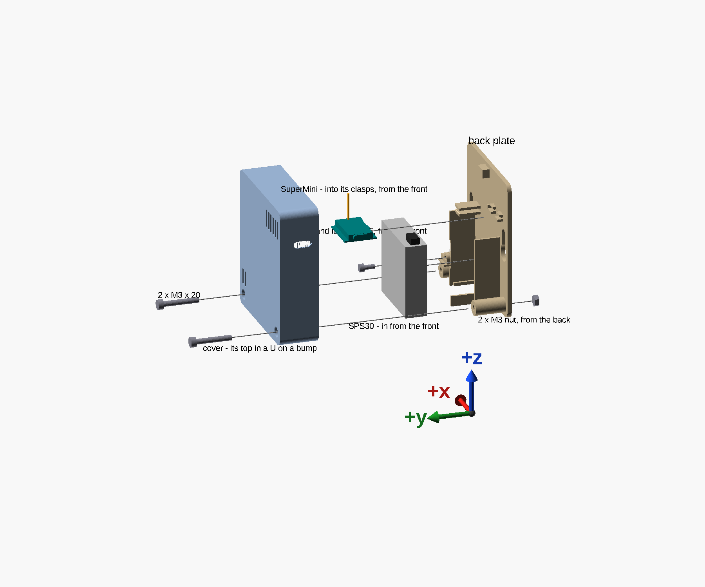

# Assembly

## You need

- the two printed parts, from the fits found by [the clearance test](clearance-test.md);
- the ESP32-C3 SuperMini, the SPS30 with its lead, and the GY-SGP41;
- two **M3 × 20 socket head cap screws** and two **M3 nuts** for the cover;
- one **M2.5 × 6 socket head cap screw** for the SGP41;
- two **4 × 20 chipboard screws**, and their wall plugs, to hang it;
- **22 AWG solid hookup wire** for the SGP41's four wires;
- no tape and no glue: everything is held by the printed parts.

## Order

All of this happens before the cover goes on.

1. **Put the two nuts in.** Start each M3 nut square in its hex pocket from the back of the plate — the
   wall side. It seats 1.4 mm in, past where a thumb can push it: drive an M3 × 20 in from the other end
   of the boss and tighten until it draws the nut up to its shoulder, then take the screw out. The pocket
   is a press fit, so the nut stays.
2. **Set the SPS30 in from the front**, its lead plugged in, between its channel walls and onto its
   ledges, label towards you and air face down. Nothing on the plate overhangs it.
3. **Push the SuperMini's back edge into its clips** from the front, component side up and its antenna's
   pole standing up, until the edge snaps past the clips' catches. The back edge is the one whose first two
   pins are GPIO5 and GPIO6; its antenna end goes against the back stop.
4. **Screw the SGP41 on**, with its four wires already soldered into it from its back (see
   [Wiring](wiring.md)): lay it flat on its post and rib, sensor towards you and pins up, its bottom edge
   on its ledge, and drive the M2.5 × 6 through its mounting hole into the post's pilot. The first drive
   cuts the thread.
5. **Wire it** — see [Wiring](wiring.md).
6. **Put the cover on**, straight onto the plate: the U at its top goes over the plate's bump, its front
   clasp takes the board's front edge, and its partition slides past the divider. Then drive the two
   M3 × 20 screws through its bottom corners into the nuts. Their heads end flush with the front.

The two "from the front" directions are not arbitrary. Each part's way in is checked against the back
plate in the model: the SuperMini's push into its clips, and the SPS30's path in. See
[Checking it](checking.md).

## Hanging it

On two screws, by the keyholes in the back plate — the way a wall clock hangs.

1. **Drive the two screws level, 55.3 mm apart**, where the box's bottom edge will be 46.8 mm below them.
   The divider stands another 4 mm below that edge.
2. **Leave each head standing about 3 mm off the wall** — between 2.4 and 3.4 mm. The plate is 2.4 mm
   thick, and the room behind it is 1 mm deeper than the head.
3. **Put both heads through the round openings, then let the box down.** The screws ride up the slots
   and the heads hold the plate against the wall. One screw may sit up to 2 mm lower than the other; its
   slot is that much longer.

The right-hand screw's steel head sits about 2 cm from the board's antenna. After hanging the box,
compare the node's Wi-Fi signal (RSSI) with what it reads on the bench.

**Clip the USB-C cable to the wall 3–5 cm from the plug**, on your right, with a stick-on cable clip. The
box has no cable clamp: a plug's body runs 2–3 cm out from the box's side before the cable starts, so
anything on the box would force the cable into a loop. The clip takes the cable's weight and pull off the
socket. The socket does not need one: its shell-sized opening takes side loads into the wall, and the
thinned wall takes a pull. More in [The USB-C end](usb-c-end.md).
