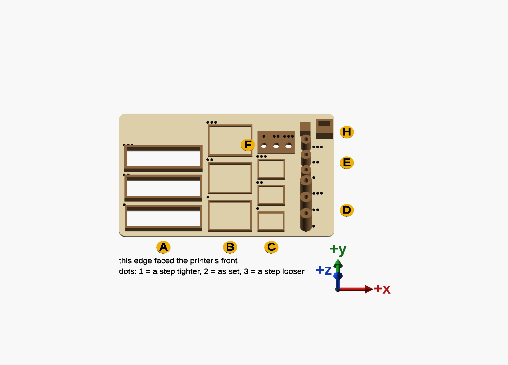
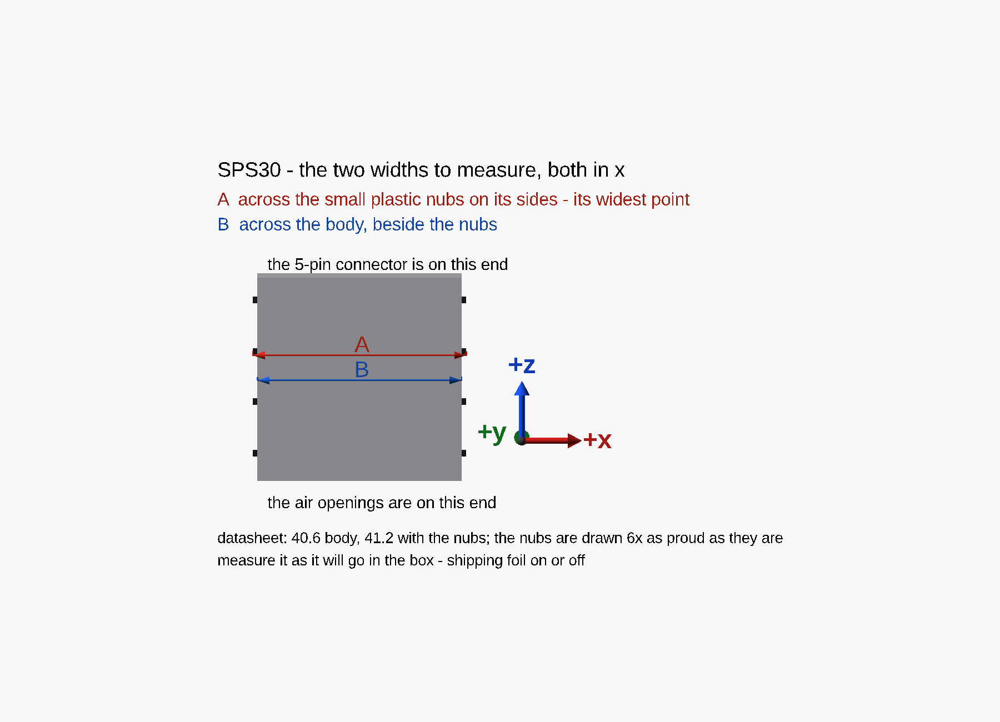

# The clearance test

**Print [`print-chamber-box-fits.scad`](../print-chamber-box-fits.scad) before the box**, in the same ASA
with the same profile: one flat part, about 1 h 45 min and 15 g. It tries every fit three ways, and every
size comes from the box's own settings, so it tests exactly what the box will print.

## Which piece is which

Drawn by [`fits-map.scad`](../fits-map.scad), which includes the test. **Hold the part with the three big
SPS30 frames on your left and the row of bosses on your right** — then it matches the picture, with the
edge that faced the printer's front nearest you.

The arrows are the part's own axes, as it lay on the bed: **+x to the right, +y away from the front edge
(up the picture), +z up off the bed, towards you.** A reading given as "in x" or "in y" uses them.

Each try carries **1, 2 or 3 dots**: 1 = a step tighter, 2 = as set, 3 = a step looser. The values below
are for 1 / 2 / 3 dots.

| | Pieces | Setting | 1 / 2 / 3 dots | Try | Pick |
|---|---|---|---|---|---|
| **A** | the three big open frames | `sps_fit` | 0.1 / 0.2 / 0.3 | slide the SPS30 through each | the tightest it slides through without forcing |
| **B** | the three large trays | `pocket_fit` | 0.1 / 0.2 / 0.3 | drop the SuperMini in | the tightest it drops into and lies flat in, without pressing |
| **C** | the three small trays | `pocket_fit` | 0.1 / 0.2 / 0.3 | drop the GY-SGP41 in | as for B |
| **D** | the three **tall** bosses, nearest the front | `pilot_d` | 2.1 / 2.3 / 2.5 | drive an M3 × 14 self-tapping screw fully in, then back out — once per boss, since the first drive cuts the thread | the one that bites firmly without splitting the boss or taking real force |
| **E** | the three **short** bosses, behind them | `gy_pilot_d` | 2.0 / 2.1 / 2.2 | the same with the M2.5 × 8 cap screw, through the GY-SGP41's hole: the pilot is as deep as the box's, which counts on the board under the head | as for D |
| **F** | the hole bar's row **next to the C trays** | `screw_d` | 3.0 / 3.2 / 3.4 | an M3 screw | the smallest it passes through freely |
| **G** | the 2 Oct print's hole bar has a second row, the larger holes | ~~`tab_hole_d`~~ | retired | — | the mounting tabs it was for went on 3 Oct 2026: the box hangs by a keyhole. A reprint has no G |
| **H** | the peg, and the block with the socket beside it | `part_fit` | — | calipers: the peg's width and the socket's | the socket is drawn 0.6 mm wider. If (socket − peg) / 2 comes out under 0.15 mm, the box's parts will bind — raise `part_fit` by the shortfall |

**The hole bar has one group of dots over each hole.** On the 2 Oct print the groups sit between its
two rows, and count for both.

The keyhole the box hangs by is not tried here: it is sized from the wall screw with room to spare —
0.6 mm round the thread, at least 1 mm of plate under the head each side — once the screw is measured.

The values follow the settings, so after a setting changes, a reprint tries a new ladder round it. The
table shows the ladder a reprint would try now; the results below give the one the print tried.

## Turning a result into a setting

Set the value in [`print-chamber-box.params.scad`](../print-chamber-box.params.scad) and delete its name
from `untested_fits`. If even the tighter try is loose, or the looser one still binds, the ladder was in
the wrong place: say so, and it moves.

## Results

All from the one print of 2 Oct 2026.

| Read | Group | Setting | Ladder | Pick | Now |
|---|---|---|---|---|---|
| 2 Oct 2026 | A | `sps_fit` | 0.2 / 0.3 / 0.4 | 1 dot, snug | **0.2** |
| 2 Oct 2026 | B and C | `pocket_fit` | 0.2 / 0.3 / 0.4 | 1 dot for both boards, snug | **0.2** |
| 3 Oct 2026 | A, closer | `sps_fit` | 0.2 / 0.3 / 0.4 | 1 dot: flush in y, across the sensor's thickness; about 0.7 mm loose in x, along its width | **0.2** |
| 3 Oct 2026 | D | `pilot_d` | 2.3 / 2.5 / 2.7 | 2 dots fine; 1 dot a little tight, which may be better for a thread driven again each time the cover comes off. None split | **2.3** |
| 3 Oct 2026 | E | `gy_pilot_d` | 2.0 / 2.1 / 2.2 | 2 dots fine; 1 dot a little tight | **2.1** |
| 3 Oct 2026 | F | `screw_d` | 3.2 / 3.4 / 3.6 | 1 dot: an M3 passes freely | **3.2** |
| 3 Oct 2026 | H | `part_fit` | — | peg 5.98; socket 6.50 in y, 6.55 in x — 0.26 and 0.29 per side | **0.3** |

- **A, B, C, D and F** each took the tightest try, so nothing tighter has been tried.
- **A's x play was the width allowance, not the fit.** The frame's width was the datasheet's 41.2 mm
  across the sensor's side nubs plus the fit; flush in y said the fit itself was right. Measured on
  3 Oct 2026 instead: **41.00 across the nubs, 40.69 across the body**. The box's SPS30 channel now
  takes its width from those, so it is 0.2 mm narrower than the frame that was 0.7 mm loose:

  

  Drawn by [`sps30-measure.scad`](../sps30-measure.scad), in the clearance test's axes.
- **D's screws stopped about 1 mm short in all three bosses**, because that print's pilots were 13 mm
  deep for a 14 mm screw. The three still compare. The test's pilots are now 15 mm deep. The box was
  never short: its pilots are 18.8 mm deep, against the 12.2 mm of screw that passes through the cover.
- **H**'s 0.26–0.29 mm is over the 0.15 mm floor, so `part_fit` stays at 0.3.

**G is retired**, untested: on 3 Oct 2026 the box's mounting tabs, whose holes it tried, gave way to a
keyhole for one wall screw.
