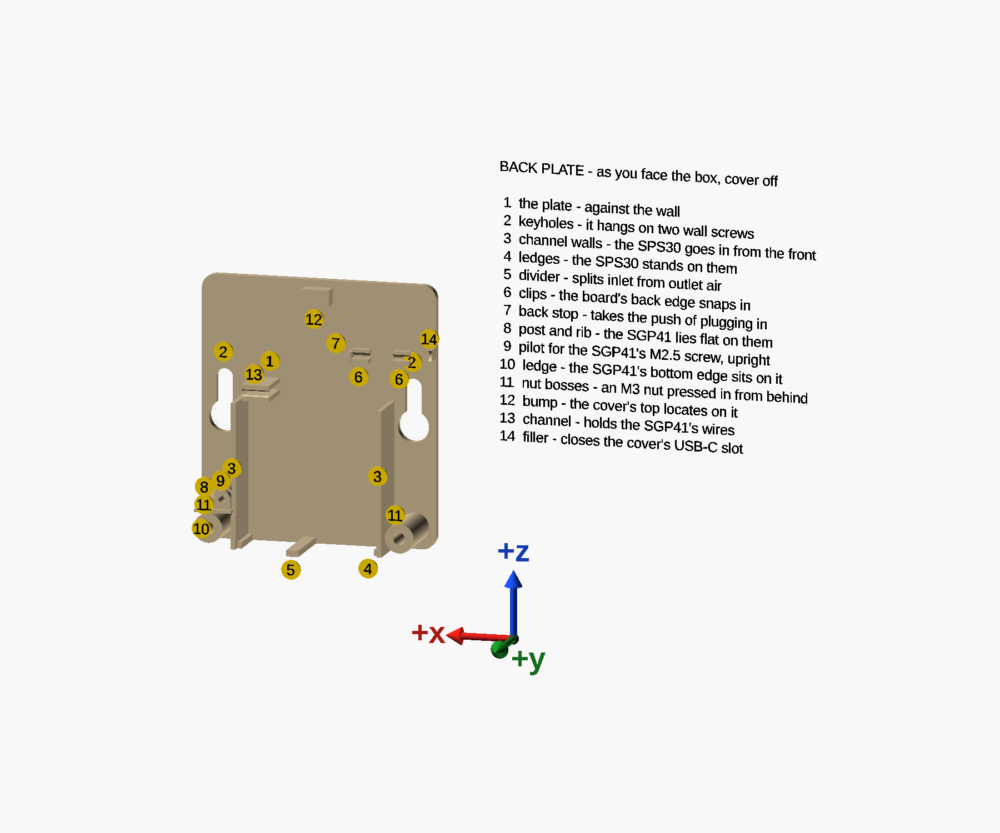
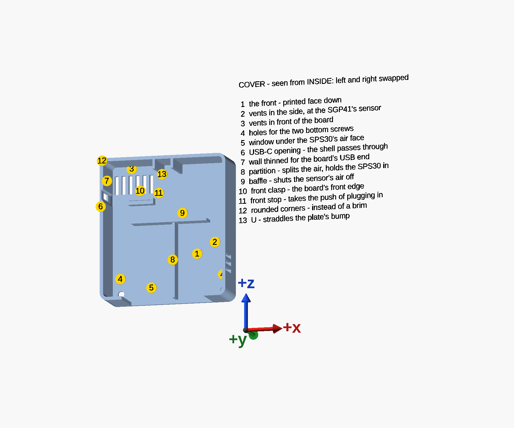

# What each feature is for

Drawn by [`feature-map.scad`](../feature-map.scad), which includes the model, so the numbers move with it.

## The back plate

As you face the box with the cover off:

1. **The plate** — the back of the box, flat against the wall. Everything else stands on it, and it
   prints flat on the bed.
2. **Keyholes** — the box hangs on two wall screws, like a wall clock: each head goes in through a round
   entry, and the box drops so the screws ride up the slots above, their heads behind the plate. One sits
   in each side column, beside the SPS30's top corners. Each slot is 2 mm longer than it needs to be, so
   one screw may sit that much lower than the other. Holes through the plate, so they print as openings
   in the first layers.
3. **Channel walls** — the SPS30 is set between them from the front, and they hold it sideways. They
   have no lips: anything over the sensor's face would block its way in.
4. **Ledges** — the sensor stands on these, one under each end of its air face, clear of the openings.
5. **Divider** — carries the middle of the sensor and splits its inlet side from its outlet side. It
   stands 4 mm below the box, so the outlet's air cannot loop straight back into the inlets.
6. **Clips** — two, on the SuperMini's back edge: a lower jaw under the edge, and an upper jaw over its
   pad row whose underside angles in to a catch that pinches the PCB, then out again where the edge sits.
   The board's back edge is pushed into them from the front. One is just past the edge's second pin,
   leaving GPIO5 and GPIO6 open; the other is at the antenna end. They reach 2.1 mm onto the board.
7. **Back stop** — over the back corner of the board's antenna end. It takes the push of plugging the
   USB-C cable in; the middle of that end stays open for the antenna loop.
8. **Block and standoff** — the SGP41's. The block backs onto the SPS30 channel's wall; the 4 mm round
   standoff stands out of it, and the module's underside bears on it only round its mounting hole.
9. **Pilot** — for the M2.5 × 6 screw, sideways through the module's hole into the standoff and block.
10. **Ledge** — the SGP41's bottom edge sits on it, over the nut boss.
11. **Nut bosses** — one in each bottom corner. An M3 nut goes into each hex pocket from the wall side
    and is drawn up to its shoulder by the cover's screw.
12. **Bump** — at the middle of the top. The cover's U straddles it, which locates the cover's top.

More on 8–10 in [The SGP41's mount](sgp41-mount.md), and on 6 and 7 in [The USB-C end](usb-c-end.md).

## The cover

Seen from inside — from the wall — so its left and right are swapped against the box as you face it:

1. **The front** — printed face down, so it comes out flat.
2. **Vents in the side** — room air reaches the SGP41's sensor, 2–3 mm behind them.
3. **Vents in front of the board** — the board's warmth leaves here. With the side vents lower down they
   should act as a small chimney, drawing fresh air in past the SGP41 (reasoned, not measured).
4. **Bottom screws** — the two M3 × 20 screws' heads sit flush, each in a counterbore 6.0 mm across and
   3.0 mm deep. The front is only 1.8 mm thick, so a boss on its inside carries the floor the head
   clamps on, and the back plate's nut boss meets that boss.
5. **Window** — most of the bottom wall is open under the SPS30's air face, so its inlets and outlet
   breathe the room directly. Open at the back edge, so it prints without a bridge.
6. **USB-C opening** — the size of the socket's metal shell. The socket's mouth reaches the outside face,
   so any cable seats fully.
7. **Thinned wall** — 0.9 mm over the board's USB-C end, so the board reaches into it and the socket
   reaches the outside. The board's corners bear on it when a plug is pulled; its 45° steps keep a crack
   from starting.
8. **Partition** — continues the divider up the air gap in front of the sensor, so the inlet air and the
   outlet air stay apart. It stands 0.2 mm off the sensor's face, so it also keeps the SPS30 from tipping
   forward.
9. **Baffle** — closes that air gap off from the compartment above, so the board's warmth does not drift
   down into the sensor's air.
10. **Front clasp** — takes the board's front edge from its 4th pin to its antenna end: a rim in front of
    the edge, a lip 0.9 mm over its pad strip and a ledge under it. The edge slips in as the cover goes on.
11. **Front stop** — over the front corner of the board's antenna end, the back stop's twin.
12. **Rounded corners** — ASA lifts at sharp corners; the radius is what lets both parts print without a
    brim.
13. **U** — two arms hanging from the top wall, either side of the plate's bump. They locate the cover's
    top; the two bottom screws hold the cover on.
