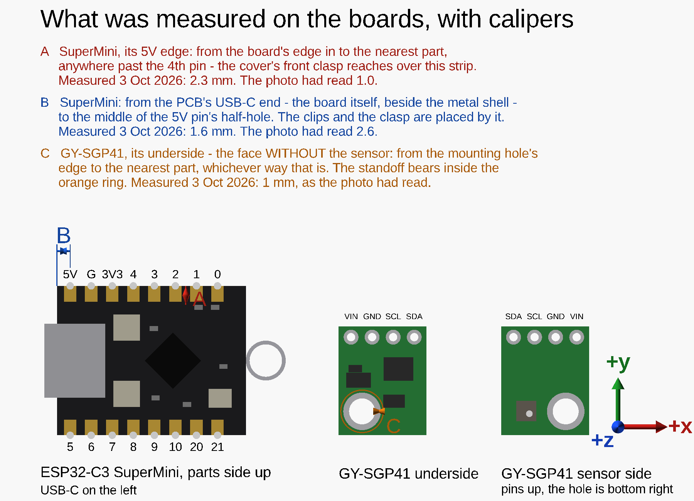

# Parameters

Every dimension has a name in [`print-chamber-box.params.scad`](../print-chamber-box.params.scad), so a
value goes in against its name rather than a description. This page says where each came from.

If a part changes, set the new value there. A value not yet measured goes in the `unmeasured` list,
and the model warns until it is. The list is empty now.

## Sourced

From the **SPS30 datasheet v2.0**, Figure 7:

| Name | Value | Note |
|---|---|---|
| `sps_h` | **40.6 ± 0.3** | without the shipping foil, which can stay on. The datasheet gives the same for `sps_w`, and 41.2 across the side nubs; both were measured instead, below |
| `sps_t` | **12.2 ± 0.3** | |
| `sps_mass` | **26.3 g** | |

From the **USB Type-C specification**, rev 1.2, so that no cable needs measuring:

| Name | Value | Note |
|---|---|---|
| `usb_shell_w` | **8.94** | the receptacle's inside opening is 8.34 × 2.56; the measured 3.16 height against 2.56 gives a 0.30 mm shell wall, so 8.34 + 2 × 0.30 |
| `usb_plug_w`, `usb_plug_h` | **12.35 × 6.5** | the largest a compliant plug's body may be (Figure B-1, dimensions 1 and 14). The body stays outside the box, so these only check that it clears the mounting surface |

From **ISO 4762**, the SGP41's M2.5 × 8 socket head cap screw: `gy_head_d` **4.5**, `gy_head_h` **2.5**.

## The wall screws

The two 4 × 20 chipboard screws the box hangs on, measured 3 Oct 2026. They size the keyholes: the entry
is the head plus 1 mm (9.2 mm as cut), the slot the thread plus 0.6 mm (4.9 mm as cut), and an assert
keeps at least 1 mm of plate under the head on each side. The clearance test's G row agrees on the
thread: of 3.8, 4.0 and 4.2 mm holes, the screw fits the 4.2.

| Name | Value | What |
|---|---|---|
| `key_shank_d` | **4.0** | the thread, across |
| `key_head_d` | **7.9** | the head, across |
| `key_head_h` | **2.68** | the head, tall. A chipboard screw's head is usually countersunk; the room behind the plate is drawn as a cylinder the head's full size, which holds for either shape |

## Measured

With calipers on the parts in hand, 2 Oct 2026 unless dated. Three were read off photos first and
measured on 3 Oct 2026 — A, B and C here:

Drawn by [`board-measure.scad`](../board-measure.scad), the boards as they lie on the table.

| Name | Value | What |
|---|---|---|
| `sps_w` | **40.69** | across the SPS30's body, beside its side nubs — measured 3 Oct 2026, reading B in [the figure](sps30-measure.png) |
| `sps_nub` | **0.155** | each side: 41.00 across the nubs (reading A), less the body, halved. The datasheet's 41.2 left the clearance test's frame A about 0.7 mm loose |
| `divider_from_inlet_end` | **17.7** | from the SPS30's inlet end to the middle of the blank gap before the outlet grille. Scaled off a straight-on photo against the sensor's 40.6 mm width; three features land within 0.4 mm of the datasheet, so the scale holds. The gap runs from `sps_inlet_end` 15.2 to `sps_outlet_from` 20.2, and an assert keeps the divider inside it |
| `sm_l`, `sm_w` | **22.8 × 18.03** | the SuperMini's PCB, not counting the USB-C shell |
| `sm_pcb_t`, `sm_t` | **0.85**, **4.05** | the bare PCB; the PCB with its tallest part, the USB-C shell, without the antenna |
| `usb_shell_h`, `usb_overhang` | **3.16**, **1.5** | the USB-C shell's height, and how far it overhangs the PCB's edge |
| `ant_h`, `ant_over` | **18.8**, **4.81** | the antenna wire's tip above the PCB's underside; how far its loop reaches past the PCB's antenna end, in the board's plane |
| `ant_loop_free` | **4.3** | how much of the antenna end the loop leaves free beside it — 4.3 mm one side, 5.45 the other; the smaller is used both sides |
| `sm_edge` | **2.3** | the strip along each long edge of the SuperMini's component side that carries only its castellated pads: from the board's edge to the nearest part. Reading A, on the 5V edge past the 4th pin; the photo had read 1.0. The back edge was not measured — only the clips reach over it, and they keep within `clip_room`. The cover's front lip reaches 0.9 mm over it |
| `pin_mid` | **1.6 + 2.54** | the middle of the SuperMini's three power pins, from its PCB's USB-C end — the board, not the shell that overhangs it. Reading B puts the 5V pin's middle 1.6 mm from that end; the photo had read 2.6, because the shell hides the board's end. The clips and the front clasp are placed from it |
| `cable_zone_h` | **10** | above the SPS30's connector face, with the lead plugged in and bent over as tightly as it comfortably goes |
| `conn_from`, `conn_to` | **2.0**, **10.5** | where the SPS30's plug and lead sit along its top face, from the outlet end: the wires leave 3.0–8.6 mm from that end, and the housing reaches about 1 mm past each |
| `gy_l`, `gy_w`, `gy_t` | **13.14 × 10.60 × 3.24** | the GY-SGP41 with its parts. The sensor is on one face and the rest of its electronics on the other |
| `gy_back` | **2.53** | the GY-SGP41 through its PCB and electronics, clamped beside the sensor: its height lying sensor-up |
| `gy_bare` | **3.31** | from the GY-SGP41's far end (opposite its pins) to the nearest part on its underside |
| `gy_hole_bare_d` | **3.13 + 2 × 1.0** | the bare patch round the mounting hole on the underside: reading C, 1.0 mm from the hole's edge to the nearest part, as the photo had read. The 4 mm standoff bears inside it, and the collision check treats its edge as where the parts begin |
| `gy_hole_d` | **3.13** | the GY-SGP41's mounting hole, across |
| `gy_hole_far`, `gy_hole_side` | **1.32**, **1.25** + half the hole | from the hole's edge to the module's far end, and to the nearer long edge (the one away from the sensor). The file adds half the diameter to put the centre at 2.885 and 2.815 |
| `gy_hole_right` | **true** (photo) | which way round the module is: seen from its sensor side with its pins up, the hole is at the bottom right and the sensor at the bottom left — the GY-SGP41 in [the figure](board-measure.png). From photo 2, which is not mirrored: the SuperMini's labels in the same photo read the right way round. Standing on edge with its sensor towards the side wall and its pins up, the module's hole is therefore by its front edge, away from the plate |

## Bounds, not measurements

The design works anywhere inside these, so none needs measuring:

| Name | Value | Why |
|---|---|---|
| `gy_pcb_min`, `gy_pcb_max` | **0.8**, **1.6** | the GY-SGP41's bare board thickness. GY modules are usually 1.0–1.6 mm |

## Fits

Clearances that depend on the printer and the filament, found with [the clearance test](clearance-test.md):

| Name | Value | Status |
|---|---|---|
| `sps_fit` | **0.2** | tested 2 Oct 2026, snug — clearance per side round the SPS30. Flush across its thickness, about 0.7 mm loose along its width, until the width was measured (`sps_w`, `sps_nub` above) |
| `pocket_fit` | **0.2** | tested 2 Oct 2026, snug — clearance per side round both boards |
| `part_fit` | **0.3** | tested 3 Oct 2026, 0.26–0.29 per side as printed — between a back-plate feature and the cover |
| `pilot_d` | **2.3** | tested 3 Oct 2026, a little tight — pilot for the cover's M3 × 14 self-tapping screws |
| `gy_pilot_d` | **2.1** | tested 3 Oct 2026, fine — pilot for the SGP41's M2.5 screw |
| `screw_d` | **3.2** | tested 3 Oct 2026, passes an M3 freely — clearance hole for the M3 screws in the cover |

Every fit has been tested, so `untested_fits` is empty; a fit added later goes in it untested, and
`scad-check.sh` exits 2 until it is cleared. The mounting tabs' `tab_hole_d` went with the tabs on
3 Oct 2026.

## Not in the params file

The wiring drawing ([`assembly-views.scad`](../assembly-views.scad)) draws the SGP41's wires as the
lab's **22 AWG solid hookup wire, UL1007, 1.56 mm** over its insulation (`gy_wd`, measured 2 Oct 2026).
The room the model keeps for them, `wire_room`, follows from it.
