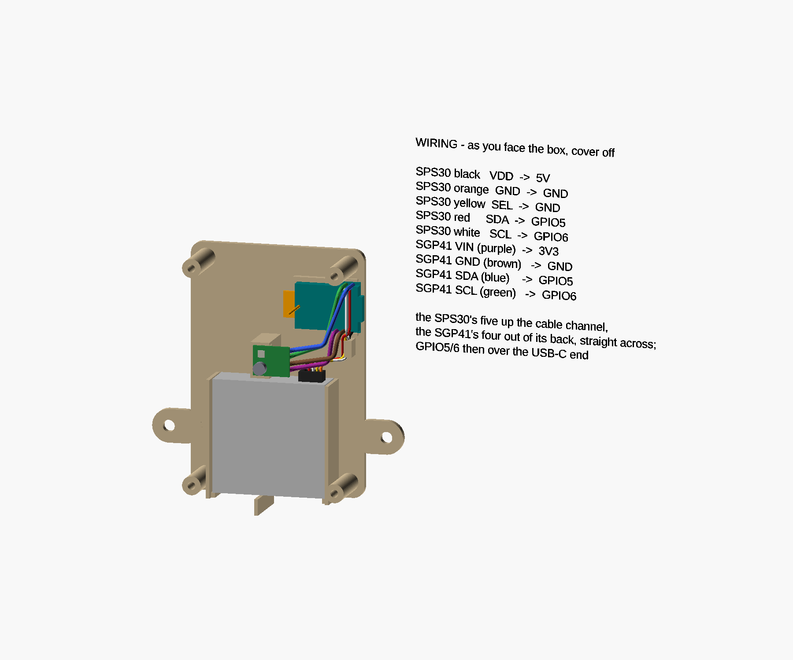
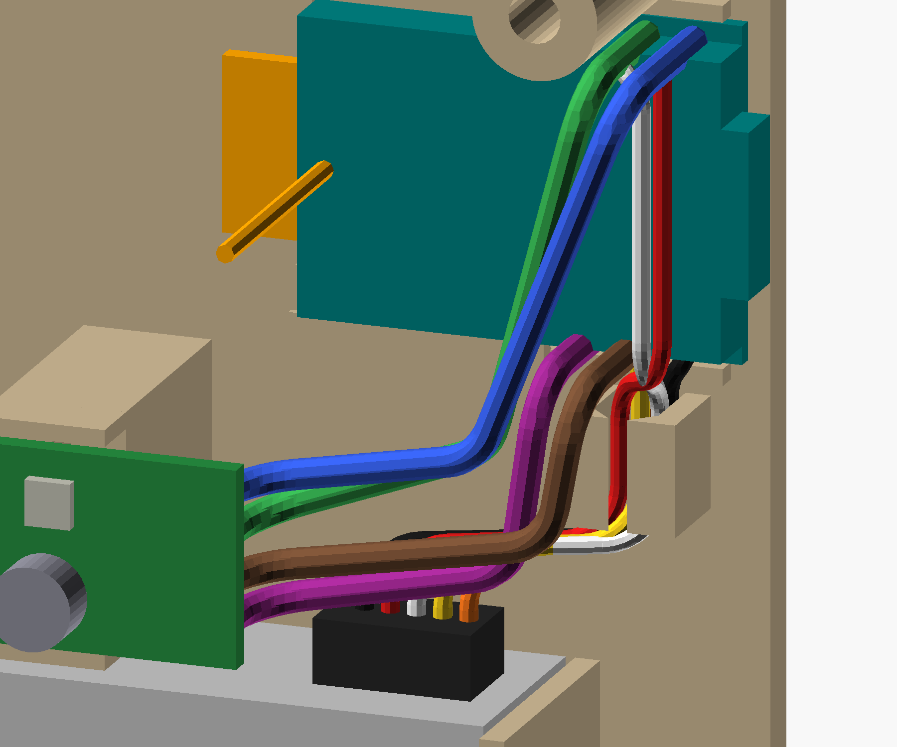

# Wiring

**Solder at the SuperMini, from its component side, with no headers.** Pin headers and Dupont housings
stand about 22 mm off the board, and there is not that much room in front of it. The sensors keep their
own connectors — or in the SGP41's case its own pins — so either can be swapped without unsoldering the
SuperMini.

## Which wire goes where

| Wire | From | To the SuperMini | Its edge, as installed |
|---|---|---|---|
| SPS30 black | pin 1, VDD | **5V** | lower edge, 1st from the USB-C end |
| SPS30 orange | pin 5, GND | **GND** | lower edge, 2nd |
| SPS30 yellow | pin 4, SEL | **GND** | lower edge, 2nd |
| SGP41 GND | GND | **GND** | lower edge, 2nd |
| SGP41 VIN | VIN | **3V3** — never 5V | lower edge, 3rd |
| SPS30 red | pin 2, SDA | **GPIO5** | upper edge, 1st |
| SGP41 SDA | SDA | **GPIO5** | upper edge, 1st |
| SPS30 white | pin 3, SCL | **GPIO6** | upper edge, 2nd |
| SGP41 SCL | SCL | **GPIO6** | upper edge, 2nd |

The SPS30's colours are its own lead's, checked with a meter —
[`firmware/print-chamber.yaml`](../../../firmware/print-chamber.yaml) says how, why colours are not to be
trusted on another lead, and why the SGP41's VIN must be 3V3. Three wires share the GND pad: twist the
SPS30's orange and yellow together first.

## The routes

The routes are drawn by [`assembly-views.scad`](../assembly-views.scad). They are illustrative — a wire
bends where it likes — but each ends on its pin from the table, and the drawing checks them (see
[Checking it](checking.md#the-wire-routes)). The SGP41's colours in the pictures are stand-ins.

**The SPS30's lead**

- It rises from its plug at the outlet end and bends over towards the right wall. Its column is kept
  clear of printed parts: the SGP41's pedestal stands to its left and the cable channel to its right.
- **Shorten the lead** so it reaches the board with about a centimetre to spare, rather than coiling it.
  The SPS30 has a fan, and a slack lead buzzes.
- **Press its five wires into the cable channel** from the front, past the lips. The channel stands
  upright under the board's power pins and holds the wires in place; nothing pulls on them inside a
  closed box, so it does not need to grip.
- From the channel's top, 5V, GND and 3V3 are straight above, on the board's lower edge. GPIO5 and GPIO6
  are on its upper edge, so those two wires cross the front of the board **over its USB-C end**, about
  8 mm out. GPIO6's pad is straight above GND's, so its wire rises half a pin aside, between the 5V and
  GND pads, which leaves GND's pad open for the SGP41's wire coming in from the front.

**The SGP41's four wires** — 22 AWG solid

- They do not use the channel. **Solder them to come out of the module's back**, before it is screwed
  down: they leave straight towards the plate, then bend over, at least 1 mm from the board and round
  no tighter than about 3 mm.
- They run across to the SuperMini about 12–14 mm out from the plate, in front of the SPS30's lead,
  along under the board until they are past its middle, then up to their pins and straight into them.
- The module's pins run SDA, SCL, GND, VIN down its edge, the reverse of the board's order, so two pairs
  cross; one wire lies behind the other there.
- Cut each to length at its pad. Solid wire holds the shape it is bent to, so bend each to its route
  before soldering its second end.

**Never** run a wire across the board's antenna half, in front of the antenna wire, or anywhere in the
window or the air gap in front of the SPS30.
