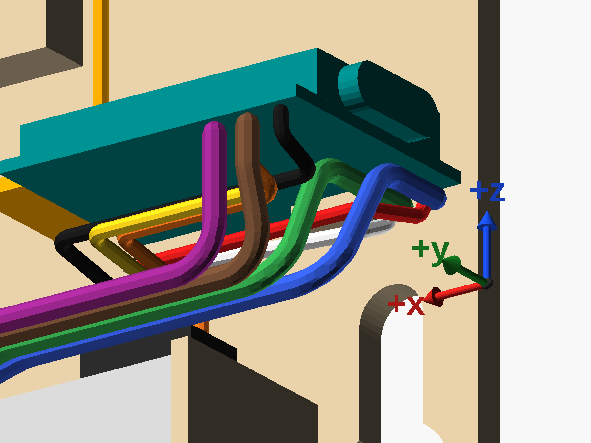

# Wiring

**Solder each wire into its pad's half-hole at the SuperMini's edge, with no headers.** Every wire comes
up to its pad from under the board, and every pad the node uses is at the board's USB-C end — so no wire
goes near the antenna. The sensors keep their own connectors, or in the SGP41's case its own pin holes,
so either can be swapped without unsoldering the SuperMini.

## Which wire goes where

The board's **front** edge faces the cover; its **back** edge lies against the back plate. Pins count
from the USB-C end.

| Wire | From | To the SuperMini | Its edge, as installed |
|---|---|---|---|
| SPS30 black | pin 1, VDD | **5V** | front, 1st |
| SPS30 orange | pin 5, GND | **GND** | front, 2nd |
| SPS30 yellow | pin 4, SEL | **GND** | front, 2nd |
| SGP41 GND | GND | **GND** | front, 2nd |
| SGP41 VIN | VIN | **3V3** — never 5V | front, 3rd |
| SPS30 red | pin 2, SDA | **GPIO5** | back, 1st |
| SGP41 SDA | SDA | **GPIO5** | back, 1st |
| SPS30 white | pin 3, SCL | **GPIO6** | back, 2nd |
| SGP41 SCL | SCL | **GPIO6** | back, 2nd |

The SPS30's colours are its own lead's, checked with a meter —
[`firmware/print-chamber.yaml`](../../../firmware/print-chamber.yaml) says how, why colours are not to be
trusted on another lead, and why the SGP41's VIN must be 3V3. Three wires share the GND pad: twist the
SPS30's orange and yellow together first.

## The routes


At the board's USB-C end, from below and in front — the SGP41's four thick wires and the SPS30's five thin
ones, each meeting its pad:



Both are drawn by [`assembly-views.scad`](../assembly-views.scad). The routes are one way the wires can
go — a wire bends where it likes — but each ends on its pin from the table, and the drawing checks them
(below). The SGP41's colours in the pictures are stand-ins: purple VIN, brown GND, blue SDA, green SCL.

**The SPS30's lead**

- It rises from its plug at the outlet end and bends over towards the board's USB-C end, inside the
  10 mm above the sensor its lead is given.
- **Orange and yellow**, for the front GND pad, run along the front at one height; **black** for 5V, and
  **red and white** for the back pads, run a wire higher — so each passes over the others' bends.
- Black, orange and yellow come straight up into the front pads from below.
- Red and white run behind the others, over the left wall screw's head, then under the SGP41's SDA and SCL
  to the same pads, and come up beside them at the end.
- **Shorten the lead** so it reaches the board with about a centimetre to spare, rather than coiling it.
  The SPS30 has a fan, and a slack lead buzzes.

**The SGP41's four wires** — 22 AWG solid

- **Solder them to come out of the module's back**, before it is screwed down: they leave towards the
  SPS30's channel, then turn up, at least 1 mm from the board and round no tighter than about 3 mm.
- They step out from the plate low in the module's column, below the right wall screw's head, and rise
  straight past it.
- Once level, they cross over the SPS30's top-left corner in **the wire channel** on the plate: press
  them in from the front past its lips, SDA nearest the plate and VIN outermost.
- Past the channel they **slant forward** — gently, so the slant does not bring them together — to cross
  the rest of the SPS30's top in front of its plug, about 3 mm above the sensor: under the lead's wires,
  and about 10 mm under the antenna.
- At the board's USB-C end, **SDA and SCL** climb to lie against the board's underside and run back to
  GPIO5 and GPIO6; **VIN** climbs straight up into 3V3; **GND**, which passes behind VIN, slants up into
  its pad beside it.
- The module's pins run SDA, SCL, GND, VIN from the plate outwards, and the wires keep that order all the
  way, so no two cross.
- Cut each to length at its pad. Solid wire holds the shape it is bent to, so bend each to its route
  before soldering its second end.

**Under the back pads, two wires lie stacked**: the SGP41's against the board and the lead's under it.
That is why the keyholes sit `back_wire_room` (3 mm) below the board rather than just under its clips —
the wall screws' heads end up under those pads.

**Never** run a wire over the top of the board, near the antenna's loop or pole, or into the window or
the air gap in front of the SPS30.

## Checking the routes

The `open` view checks the routes as it draws them, and stops with an `ERROR: Assertion` line if one
breaks — OpenSCAD still exits 0, so read the output:

- no bend tighter than its wire takes: 3 mm for the solid wire, 1 mm for the lead's;
- every wire clear of every other, except within 5 mm of a pad two of them share;
- every wire at least 3 mm from the antenna's loop and pole — they come to 4.2 mm;
- the two wires stacked under a back pad fit `back_wire_room`.

Its last line gives the tightest bend, the nearest two wires and the nearest the antenna.

The `check_wires` view intersects the wires with everything else in the box: both printed parts, the
SPS30 and its plug, the board, its parts and USB-C shell, the GY-SGP41, its screw's head, the wall
screws' heads as they slide up their keyholes, and the air gap in front of the sensor. Exported to STL it
must be empty, so OpenSCAD writes no file:

```sh
openscad -o check_wires.stl -D 'view="check_wires"' assembly-views.scad   # "Current top level object is empty"
```

It counts the strip along the GY-SGP41's pin holes, on its back, as bare — the wires leave the module
there.

Each check has a setting that breaks it, measured 3 Oct 2026:

| Setting | What it breaks | Caught by |
|---|---|---|
| `gy_pitch = 1.0` | the SGP41's wires laid closer than they are thick | an assert: 0.74 mm of overlap |
| `bend_r = 6` | segments too short for the bends asked of them | an assert |
| `ant_clear = 5` | a limit the routes, at 4.2 mm, do not meet | an assert |
| `back_wire_room = 2.5` | less room under the back pads than the stacked wires need | an assert |
| `z_cross = 45.5` | the SGP41's wires lifted half a millimetre in their channel, into its roof rib | `check_wires`: 4.8 mm³, all in the channel |

The routes are laid out for the box as built, with the outlet at the right; the view refuses
`outlet_at_left = true`.
